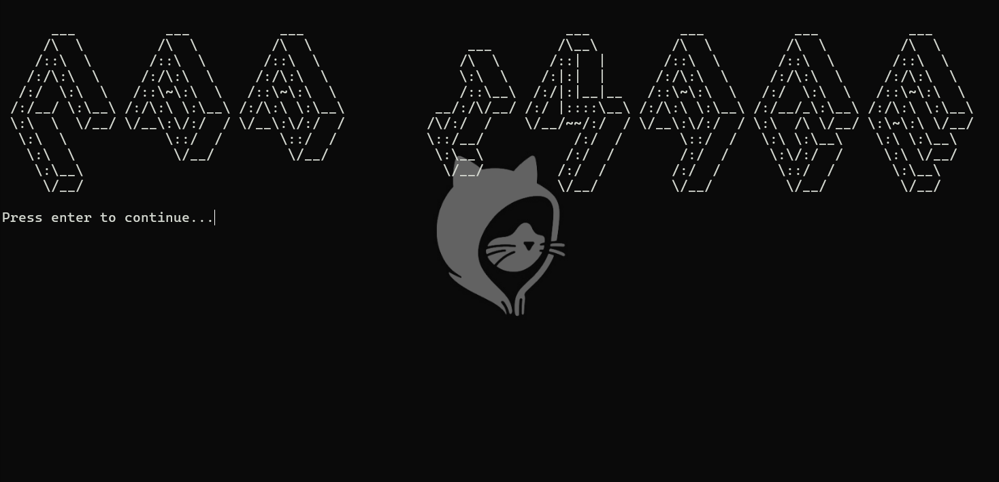

# BMP Image Manipulation Project

## Description

This project is a student project aiming to introduce to C++ data structures. It allows manipulation of BMP images, including loading, modifying pixels, and saving images.



## Installation

Clone the repository to your local machine using the following command:
```bash
git clone https://github.com/TheHardy04/CPP_ImageManipulationProject.git
```

## Usage 
### On windows

#### Prerequisites

- Visual Studio with c++ and cmake tools installed

#### Instructions 

Just open the project in Visual Studio and run it. The project is designed to be user-friendly.

### On Linux/MacOS

#### Prerequisites
- CMake 3.16 or higher

#### Instructions

The project uses CMake to build:
1. Navigate to the project directory and run the following commands:
```bash
cd CPP_ImageManipulationProject
```
2. Create a build directory and navigate to it:
```bash
mkdir build && cd build
```
3. Run CMake to generate the build files:
```bash
cmake ..
```
4. Build the project:
```bash
make
```
5. Run the project:
```bash
./ImageManipulation
```

Then follow the instructions in the console. It it designed to be user-friendly.

### Disclaimer

The project is still under development and may contain bugs. Exceptions are not handled properly, and the project may crash if the user inputs invalid data.
More of that, BMP images are a very vast field, and this project only covers the basics for the moment (24-bit BMP images).
More features will be added in the future.

## License
[MIT](https://choosealicense.com/licenses/mit/)
